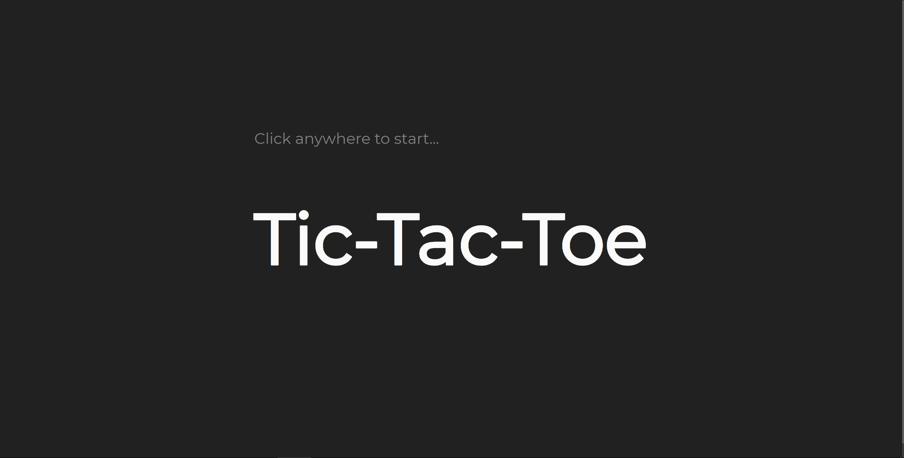
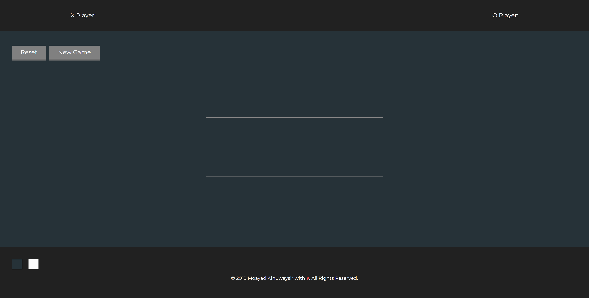

<!-- - explanations of the technologies used

- the approach taken

- installation instructions

- unsolved problems

- other useful information etc. -->

Tic-Tac-Toe
======

Demo
------
Working live demo: https://moayad93.github.io/tic-tac-toe/

Site
------

### Landing Page

### Game Board

Usage
------

### Development
Want to contribute? Great!

To fix a bug or enhance an existing module, follow these steps:

* Fork the repo
* Create a new branch (git checkout -b improve-feature)
* Make the appropriate changes in the files
* Add changes to reflect the changes made
* Commit your changes (git commit -am 'Improve feature')
* Push to the branch (git push origin improve-feature)
* Create a Pull Request

### Bug / Feature Request
If there is a bug, open an issue here by including your issue with explanation.

If you'd like to request a new function, feel free to do so by opening an issue here. Please include sample queries and their corresponding results.

Built with
------
* HTML5
* CSS3
* JQuery

To-do
------
AI to play against...

Author
------
<a href="https://github.com/Moayad93/">Moayad Alnuwaysir</a>
